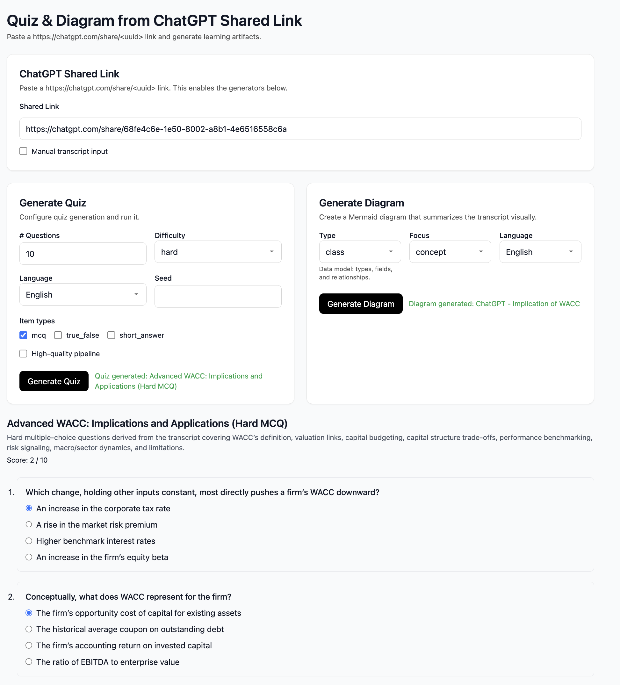

# Quiz from ChatGPT Shared Link



Web app that converts a ChatGPT shared conversation into:
- A structured, gradable quiz (MCQ / True‑False / Short‑answer)
- A Mermaid diagram that summarizes the transcript visually

This code is written in Codex.

Server routes fetch the shared page, extract the transcript, and call the OpenAI Responses API using Structured Outputs (JSON Schema). The client renders quizzes for grading/rationales and diagrams with export options.

Contents
- Overview and features
- Architecture
- Prerequisites
- Quickstart
- Configuration (environment variables)
- Usage (UI and API)
- Cost tracking and limits
- Mermaid pipeline and reliability
- Troubleshooting
- Roadmap
- License

## Overview and features

- Robust extractor for `https://chatgpt.com/share/<uuid>` pages with multiple fallbacks
- Structured quiz generation with JSON Schema enforcement and Zod validation
- Optional high‑quality pipeline (multi‑agent, multi‑pass)
- Mermaid diagram generation, refinement, and client‑side export (SVG/PDF)
- Cost tracking with per‑request circuit breaker and cumulative logging
- Privacy‑oriented: processes requests in‑memory; no server‑side storage

## Architecture

- Next.js App Router (server routes under `app/api/*`)
- Extractor: server fetch + HTML/JSON traversal + React Flight parser + readable fallback
- OpenAI Responses API with `text.format: { type: "json_schema", name, schema, strict }`
- Client UI: three cards (Shared Link → Generate Quiz → Generate Diagram)
- Mermaid pipeline: coarse→fine IR builder with static checks and sanitizers

For a diagrammed overview, see `docs/ARCHITECTURE.md`.

## Prerequisites

- Node.js 18+ (recommended: latest LTS)
- pnpm (recommended)
- An OpenAI API key with access to your target model(s)

## Quickstart

```bash
pnpm i
cp .env.example .env   # fill OPENAI_API_KEY (and any overrides)
pnpm dev
```

Open http://localhost:3000 and paste a `https://chatgpt.com/share/<uuid>` link. If extraction fails, toggle manual input and paste text.

Run tests:

```bash
pnpm test
```

Build for production:

```bash
pnpm build && pnpm start
```

Seed from a share link (CLI sample):

```bash
pnpm seed -- https://chatgpt.com/share/<uuid>
```

## Configuration

Set variables in `.env`. The most relevant are below; see `.env.example` for the full list and defaults.

- Core
  - `OPENAI_API_KEY` (required)
  - `OPENAI_MODEL` (default `gpt-5`), e.g., `gpt-5-2025-08-07`
  - `OPENAI_DIAGRAM_MODEL` (optional; overrides diagram model)
  - `OPENAI_QUALITY_MODEL` (optional; overrides HQ pipeline model)
- Extraction and privacy
  - `ALLOWED_SHARE_HOSTS` (default `chatgpt.com`)
  - `MAX_INPUT_CHARS` (default `60000`)
  - `EXTRACT_CACHE_TTL_MS` (default `300000`) and `EXTRACT_CACHE_MAX` (default `100`)
- Cost and logs
  - `OPENAI_MAX_COST_USD` per request (default unlimited)
  - `OPENAI_COST_LOG_PRECISION` (0–8, default 6)
- Reasoning effort
  - `OPENAI_REASONING_EFFORT` (low|medium|high, default high for GPT‑5)
  - `OPENAI_REASONING_EFFORT_MERMAID`, `OPENAI_REASONING_EFFORT_QUIZ` (domain overrides)
- Mermaid generation
  - `MERMAID_MAX_ITERS` (coarse→fine passes)
  - `MAX_MERMAID_REFINEMENTS` / `NEXT_PUBLIC_MAX_MERMAID_REFINEMENTS` (string refinement passes)
  - `MERMAID_REFINER_MODEL` (LLM used by refiner)
  - Label wrapping and length: `MERMAID_LABEL_WRAP` (per line), `MERMAID_LABEL_MAX_LINES`, `MERMAID_EDGE_LABEL_WRAP`, `MERMAID_SANITIZE_MAX_LABEL`

## Usage

### UI

1) Paste a ChatGPT shared link in “ChatGPT Shared Link”. The app validates the format.
2) If extraction fails, toggle “Manual transcript input” and paste raw content.
3) Generate Quiz
   - Configure number of questions, difficulty, language, seed, item types, and optional high‑quality pipeline.
   - Click “Generate Quiz”. You can grade answers client‑side, reveal rationales, and export JSON.
4) Generate Diagram
   - Select type (flowchart, sequence, class, er, state, mindmap), focus, and language.
   - Click “Generate Diagram”. Export as SVG or PDF.

### API

POST `/api/quiz`

```json
{
  "shareUrl": "https://chatgpt.com/share/<uuid>",
  "config": {
    "n_questions": 8,
    "difficulty": "mixed",
    "mix": ["mcq", "true_false", "short_answer"],
    "lang": "en",
    "seed": 42
  },
  "hq": false
}
```

POST `/api/diagram`

```json
{
  "shareUrl": "https://chatgpt.com/share/<uuid>",
  "config": { "type": "flowchart", "focus": "overview", "lang": "en" }
}
```

POST `/api/diagram/focus`

```json
{
  "shareUrl": "https://chatgpt.com/share/<uuid>",
  "focus": {
    "topic": "Megatron MoE pre-softmax",
    "mustInclude": ["router", "pre_softmax"],
    "exclude": ["dataset"],
    "maxNodes": 12
  }
}
```

GET `/api/extract?url=https://chatgpt.com/share/<uuid>` — returns normalized conversation JSON.

## Cost tracking and limits

- Every OpenAI call records token usage and cost; logs include per‑call, per‑request, and cumulative totals.
- Set `OPENAI_MAX_COST_USD` to abort a request when its budget is exceeded. The server responds with HTTP 402 and `{ error: { code: "COST_LIMIT" } }`.

## Mermaid pipeline and reliability

- Coarse→fine diagram builder: outline → expand → refine, with static checks for common Mermaid issues (missing header, unbalanced quotes, unicode punctuation, unclosed subgraph, invalid edges).
- String sanitizers normalize punctuation and IDs; label policy now uses word‑wrap with `<br/>` for nodes and subgraphs to reduce mid‑word clipping.
- Client DiagramView validates with `mermaid.parse` and suppresses Mermaid’s default error SVG; a minimal banner is shown on failure, with optional debug details from the server.
- PDF export uses UMD jsPDF + svg2pdf via CDN to avoid chunk loading issues in dev.

## Troubleshooting

- Responses API errors (e.g., “Unsupported parameter: 'response_format'”): the app uses `text.format` with JSON Schema and retries without `temperature` if required.
- “Missing required parameter: text.format.name/schema”: Confirm your environment has no conflicting custom code; the client always passes both.
- “Invalid schema … 'additionalProperties' is required to be false”: The schema normalizer sets this recursively for all object nodes.
- Mermaid parse errors: The pipeline runs static checks and a refiner; labels are wrapped at word boundaries to reduce syntax issues. If errors persist, inspect `metadata.debug` in the response.
- DOMPurify addHook issues on server: We alias `dompurify$` to an SSR‑safe shim in `next.config.mjs`.

## Roadmap

- Diagram IR schema and budgets
  - Optional fields in IR (nodes.note/group/weight and edges.label/weight) to reduce token spend
  - Auto type suggestion endpoint to pick the best diagram type with confidence
- Advanced UI
  - Diagram debug panel in non‑focus path; suggest‑type control
  - Optional “presentation mode” vs. “compact mode” label presets
- Quiz quality pipeline
  - More robust ranking/calibration; richer rationales and difficulty calibration
  - Export formats (QTI, CSV) and randomized delivery
- Reliability and performance
  - Persistent few‑shot memory for Mermaid refiner with TTL
  - Server‑side timings per stage and structured logs
- Deployment
  - Vercel presets for serverless routes and environment management

## License

This project is licensed under the MIT License. See `LICENSE` for details.
