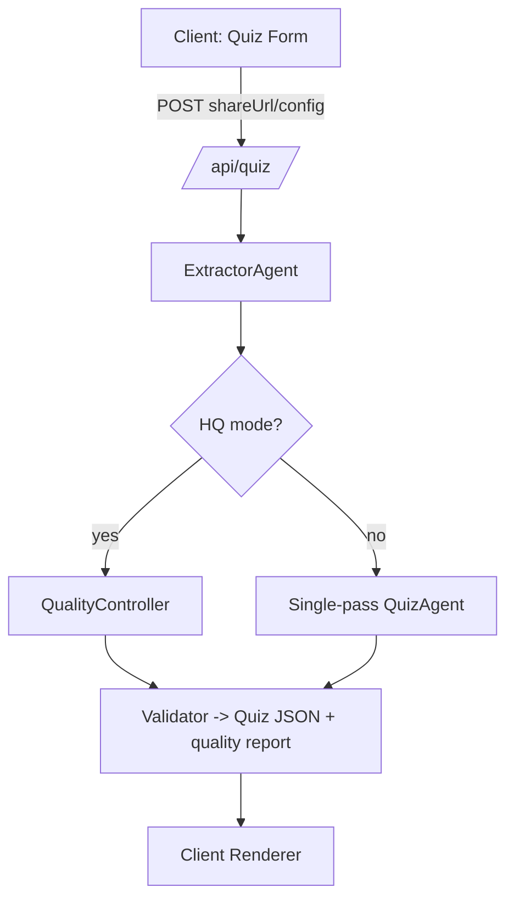

# Architecture

## Reliability

* Dual-path extraction (`__NEXT_DATA__` + `/_next/data/...`) with manual transcript fallback.
* High-quality pipeline validates each stage with JSON Schema and drops low-agreement items.
* Input size guard via `MAX_INPUT_CHARS` env setting; errors if exceeded.
* Cost circuit breaker: `OPENAI_MAX_COST_USD` aborts generation once estimated OpenAI spend crosses the threshold.

## Determinism & Privacy

* Deterministic seeds forwarded to all OpenAI calls; models configurable via `OPENAI_MODEL` / `OPENAI_QUALITY_MODEL`.
* No transcript persistence; all processing happens per request in memory.

## High-quality Pipeline (HQ)

1. **Topic mapping** – identify transcript segments and facts.
2. **Candidate generation** – over-generate items per topic.
3. **Distractor engineering** – enrich distractors with near-miss patterns.
4. **Self-consistency** – simulate solver attempts; drop ambiguous items.
5. **Redteam** – flag ambiguity/leakage and block failing items.
6. **Ranking** – select best items under coverage/difficulty rubric.
7. **Calibration & polish** – align difficulty tags and tighten phrasing.
8. **Validation** – enforce schema and produce `quality_report`.
