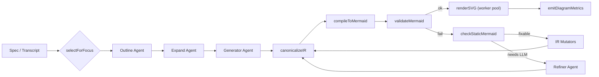

# Mermaid Pipeline Redesign (v10.x)

## Problem Statement
- Current flowchart generation frequently yields Mermaid parse errors due to non-canonical IDs, unsupported arrows, and unconstrained prompting.
- Runtime parser failures are discovered late (after compile), forcing expensive LLM retries without deterministic fixes.
- Information density is inconsistent: verbose labels, missing edge semantics, and arbitrary subgraph layouts reduce readability.
- Observability is limited; the build pipeline emits generic errors without reason codes, iteration counts, renderer usage, or parse timing.

## Mermaid v10 Grammar Subset
- Flowchart diagrams only; header always `flowchart <DIR>` with `<DIR> in {TB,BT,LR,RL}`.
- Node shapes: `{rect, decision, terminator, io, db, subroutine, stadium, circle, double_circle, hexagon, parallelogram, trap}` mapped to bracket syntax.
- Edges: canonical `-->` or `-- label -->` where `label` is in whitelist `{causes, leads_to, computes, depends_on, configures, constrains, reads_from, writes_to, validates, triggers, emits}`.
- Subgraphs allowed, titles ASCII <= 60 chars, no nested directives (no `direction` outside optional intra-subgraph alternation).
- Prohibited: `classDef`, `style`, `click`, `linkStyle`, themes, `%%{init:...}%%`, sequence/state/class/ER/mindmap diagrams, HTML labels, Markdown fences.
- Runtime config is programmatic via `mermaid.initialize` with `securityLevel: 'strict'`; all other styling handled through IR hints or renderer options.

## IR Schema & Canonicalization
- New IR schema (`lib/ir/schema.ts`) enforces ASCII labels (`<=60` chars), deterministic ID regex (`^[A-Za-z_][A-Za-z0-9_]*$`), and optional evidence metadata for traceability.
- Canonicalizer rewrites IDs, truncates labels, deduplicates nodes/edges, normalizes subgraph titles, and sorts nodes by `(weight desc, id asc)` for deterministic output.
- Sanitized IR ensures compiler operates on stable orderings, enabling byte-identical Mermaid for identical specs and predictable telemetry.

## Target Architecture

### Components
- **Spec ingestion**: API receives transcript/spec and focus profile.
- **Agents**: outline -> expand -> generate -> refine with schema-aware prompts and budget directives.
- **Mutators**: static repair (`fixByToken`, `fixByArity`, `fixByBlock`) triggered by lint reason codes prior to invoking refiner.
- **Compiler**: translates canonical IR to Mermaid using bracket shapes and canonical edges only.
- **Runtime**: sanitizes, validates via `mermaid.parse`, and renders via shared worker pool with security guardrails.
- **Telemetry**: emits metrics payload summarizing attempts, reasons, timings, and renderer choice.

## Control Flow
- **Baseline pass**: extract focus excerpt, outline IR, expand toward budgets, and generate final IR.
- **Canonicalization**: execute after every agent emission (outline, expand, generate, refine) and after mutators to guarantee stable IDs/ordering.
- **Compilation & Validation**: compile canonical IR, sanitize runtime text, run `validateMermaid`; skip rendering unless validation passes.
- **Failure loop**: on parse failure, log reason, run static lint, dispatch structural mutators per reason buckets (`TOKEN/*`, `ARITY/*`, `BLOCK/*`). Re-run canonicalize -> compile -> validate. Only escalate to refiner when automated fixes exhausted.
- **Termination**: success returns SVG + Mermaid + IR + telemetry; exhaustion returns last IR/mermaid with accumulated reasons.

## Renderer Selection Heuristic
- Compute density `edges / max(1, nodes)`. Default renderer: `ir.style.renderer` if set.
- Otherwise select `elk` when `nodes >= 25` or `density > 1.2`; fall back to `dagre` for smaller/lighter graphs.
- Honour spacing hints (`nodeSpacing`, `rankSpacing`) by injecting runtime config prior to render; never embed layout directives inline.
- Support override via `MERMAID_FORCE_DAGRE=true` for deterministic fallbacks.

## Failure Taxonomy & Recovery Strategy
- **TOKEN/RESERVED**: invalid/keyword IDs -> `fixByToken` renames via sanitizer; canonicalize reorders.
- **TOKEN/LEADING_DIGIT**: IDs starting with digits -> rename to `n_<id>`.
- **ARITY/ORPHAN_EDGE**: edges with missing endpoints -> `fixByArity` drops or stubs nodes depending on `mustInclude`.
- **BLOCK/UNBALANCED**: mismatched `subgraph/end` -> `fixByBlock` trims smallest offending block before revalidation.
- **SIZE/DEGREE_CAP** (warning): edges >12 per node triggers weight-based pruning/annotation and surfaces in metrics.
- **UNICODE_PUNCT / LABEL_BUDGET**: upstream prompts and canonicalizer enforce ASCII and truncation before compile.
- Each reason increments counters for telemetry and informs whether to loop mutators or escalate to LLM refiner with structured context.

## Telemetry & Observability
- Emit `BuildMetrics` per attempt: iterations, reason histogram, node/edge counts, density, renderer, compile/parse timings, Mermaid/app versions.
- Attach elapsed durations for generator/outline/expand/refiner passes for A/B analysis (structured logs or events).
- Persist canonical IR snapshot and final Mermaid hash for deterministic regression testing.
- Surface toggle flags (`MERMAID_REFINE_ONLY`, `MERMAID_FORCE_DAGRE`) and mutator activation to help on-call debugging.
- Integrate with existing logging pipeline; ensure no PII by truncating labels/evidence quotes before emission.

## Implementation Notes
- Golden/property tests cover canonicalization determinism, parser validation, and mutator idempotence.
- Worker pool for rendering uses bounded concurrency; ensure cleanup on hot reload.
- All agents receive explicit instructions for label budgets, ID preservation, and ASCII enforcement to minimize runtime sanitation.
